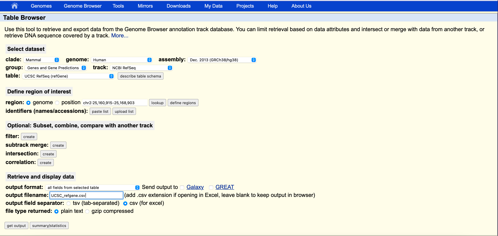
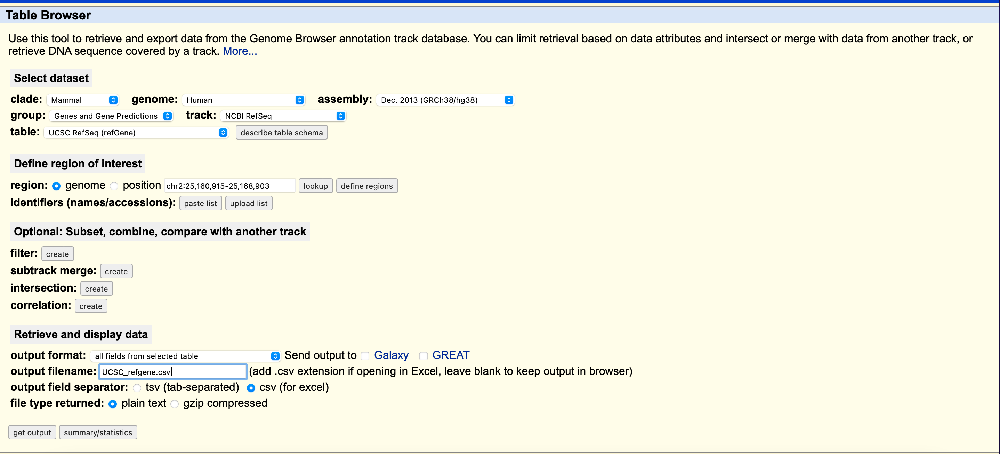

# L-CHIP-NGS-assay-and-CNV-detection

Here we present an example of how to use smMIP-tools-plus
to generate targeted sequencing panel from mutation
data obtained from COSMIC and cbioportal.
The tool has the following features
1. Read and process mutation file from COSMIC to
provide a list of genomic coordinates to target for
the cancers of the user's choice
2. Provide a list of coding exons for the genes of
the user's choice
3. Provide a list of gene for targeting CNVs in the
cancers of the user's choice
## Quick Start

smMIP-tools-plus code can be executed from the 
terminal. There is no need for installation. Copy
the code files to your folder of choice.

## Dependencies
This pipeline requires the following software and packages:

| Program                         | Packages                                     |
|---------------------------------|----------------------------------------------|
| Python (https://www.python.org) | argparse, matplotlib.pyplot, csv, re, typing |        

## Description
This tools takes as an input a cosmic mutation file,
a cbioportal or cosmic CNV file, and a UCSC gene prediction
track. It applies a set of user-defined filter to remove mutation from uninterested cancers,
intronic mutations, large indels, non-recurrent mutation. Optionally, genes can
be chosen to be targeted in its entirety, which will produce an additional output
of coding exon ranges. 

In the cosmic mutation file, there is one entry per genomic location per tumour
per sample, which mean that the same mutation from different tumour will exist 
as separate entries. First, this tool merges the entries into one mutation if
they share the exact same coordinates. Second, it ranks each mutation by its
number of tumours. Third, starting with the mutation with the greatest number of
tumours, for each mutation, it checks for all targeting windows with a user
defined window size that covers the mutation in question, and see which one covers
the most entries. Fourth, all mutations covered by a best targeting window will be
ignored for the next selection of a best targeting window. Fifth, if a best
targeting window covers an indel, then it will be noted. 

The final output are a table ranking the point mutation by the number of tumours,
a minimal list of minimal ranges targeting mutation based on the ranking of the
aforementioned table, a subset of the minimal list that covers indels, and (for CNV)
Graphically, 

## Configuration 
### To download the COSMIC mutation and CNV file
1. Go to COSMIC (https://cancer.sanger.ac.uk/cosmic)
2. Click on the top right, to register and login
3. Hover over where it is labeled genome version, and in its drop down menu select GRch38
4. Hover over download, and select downloads
5. Scroll down until you see COSMIC mutation data that include both targeted and genome-wide screens
6. In that section, select download filtered data
7. In the search bar besides “filter by cancer”, type in haematopoietic_and_lymphoid_tissue, it should allow you to autocomplete it
8. Select the download button besides it 
9. Scroll further down until you see copy number variants 
10. Repeat step 6-8 in this section for downloading CNV

### To download the cbioportal CNV file
1. Go to cBioPortal (https://www.cbioportal.org)
2. Make sure the tab is on Query, which should be the
default of the cBioPortal site
3. Select the cancer studies in the tissue filter the user
would like to target
4. Click "Explore Selected Studies"
5. Select sample pertaining to cancer types,
cancer type detailed, molecular profiles, genes
the user would like to target.
6. Go to the top right of the CNA genes box with
the 3 lines button and hover over download, and then
click on data 

### To download gene prediction track file
1. Go to UCSC Table browser (https://genome.ucsc.edu/cgi-bin/hgTables)
2. Select the following options, output filename can be anything

3. Change it to .csv extension, and select csv
(for excel) in output field separator if you want
to view it in excel


## Running the code


Go to the directory where you put the code files and type into the terminal
(if you are using cbioportal for CNV)
```
python3 COSMIC_search.py -m <cosmic mutation filename> -c cbioportal CNV file name> -s cbioportal -r <refseq gene filename>
```

(if you are using cosmic for CNV)
```
python3 COSMIC_search.py -m <cosmic mutation filename> -c cosmic CNV file name> -s cosmic -r <refseq gene filename>
```
