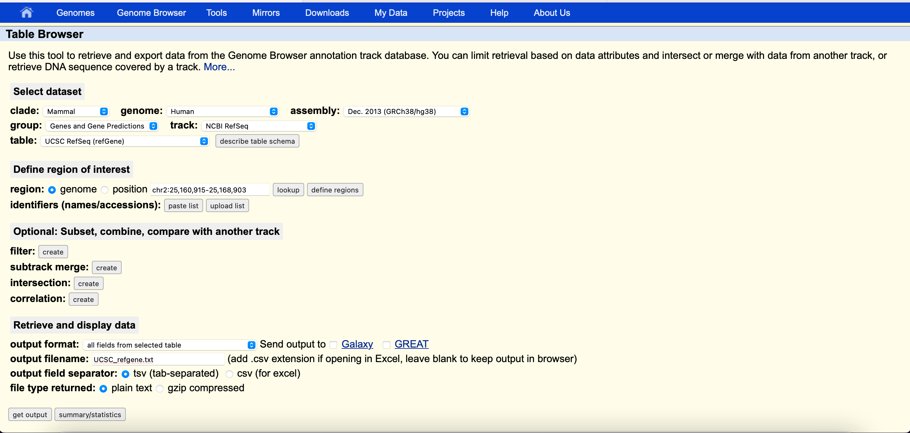

# name TBD

Here we present an example of how to use <name TBD>
to generate genomics coordinates for targeted sequencing panels from mutation
data obtained from the Catalogue of Somatic Mutations in Cancer (COSMIC)
and cBioPortal.
The tool has the following features
1. Read and process input from the COSMIC) to
provide a list of recurrent mutated genomic coordinates 
2. Provide a list of coding exons for the genes of
the user's choice
3. Provide a list of simple nucleotide polymorphism (snp) coordinates that is located
in the transcription region of recurrently mutated genes in the aspect of copy
number variation (CNV) in cancers of the user's choice
## Quick Start

A user can execute the code of this tool from the 
terminal. There is no need for installation. Copy
the code files to your folder of choice.

## Dependencies
This pipeline requires the following software and packages:

| Program                         | Packages                                             |
|---------------------------------|------------------------------------------------------|
| Python (https://www.python.org) | argparse, matplotlib.pyplot, csv, re, typing, pandas |        

Here you list the input files, explain them and how one can obtain them, provide 
your explanation about how your tool works,what it does and how to run it. The
second section should be the same but deals with CNVs. In the second section
you can also explain that the user can provide a gene list instead of using 
COSMIC or cbioportal data and how this works.


## Description
This tool takes as input a cosmic mutation file,
a cBioPortal or cosmic CNV file, and a UCSC gene
track. Users can choose only to target mutations associated with cancers.
It applies user-defined filters to target only mutations from chosen cancers.
It removes mutations from uninterested cancers, intronic mutations, large indels,
and non-recurrent mutations. Users can choose to target the coding region of any
number of genes from start to end. 

In the cosmic mutation file, there is one entry per genomic location per tumour
per sample, which mean that the same mutation from different tumours will exist 
as separate entries. First, this tool merges the entries into one mutation if
they share the exact coordinates. Second, it ranks each mutation by its
number of tumours. Third, starting with the mutation with the greatest number of
tumours, for each mutation, it checks for all targeting windows with a user-defined
window size that covers the mutation in question and sees which one covers
the most entries. Fourth, all mutations covered by a best targeting window will be
ignored for the following selection of a best targeting window. 

The final output is a table ranking the point mutation by the number of tumours,
a minimal list of minimal ranges targeting mutation based on the ranking of the
table, as mentioned earlier, a subset of the minimal list that covers indels and 
(for CNV)

Graphically, 

## Configuration 
### To download the COSMIC mutation and CNV file
1.	Go to COSMIC (https://cancer.sanger.ac.uk/cosmic)
2.	Click on the top right to log in. Registration might be required
3.	Hover over data, and select downloads
4.	Scroll down until you see COSMIC mutation data that include both targeted and genome-wide screens
5.	In that section, select download filtered data
6.	In the search bar beside "filter by cancer," type in haematopoietic_and_lymphoid_tissue; it should allow you to autocomplete it
7.	Select the download button beside it 
8.	Scroll further down until you see copy number variants 
9.	Repeat steps 6-8 in this section to download CNV


### To download the cbioportal CNV file
1. Go to cBioPortal (https://www.cbioportal.org)
2. Make sure the tab is on Query, which should be the
default of the cBioPortal site
3. Select the cancer studies in the tissue filter the user
would like to target
4. Click "Explore Selected Studies."
5. Select a sample of the cancer types,
cancer type detailed, molecular profiles, and genes
the user would like to target.
6. Go to the top right of the CNA genes box with
the three lines button and hover over download, and then
click on data 

### To download the gene track file
1. Go to the UCSC Table browser (https://genome.ucsc.edu/cgi-bin/hgTables)
2. Select the following options; the output filename can be anything

3. Change it to .csv extension, and select csv
(for excel) in output field separator if you want
to view it in excel


## Running the code


Go to the directory where you put the code files and type into the terminal
(if you are using cbioportal for CNV)
```
python3 COSMIC_search.py -m <cosmic mutation filename> -c cbioportal CNV file name> -s cbioportal -r <refseq gene filename> -p <common snp filename>
```

(if you are using cosmic for CNV)
```
python3 COSMIC_search.py -m <cosmic mutation filename> -c cosmic CNV file name> -s cosmic -r <refseq gene filename> -p <common snp filename>
```
